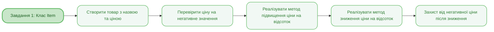
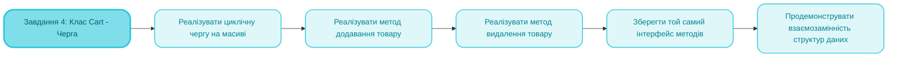

<sup>📒 Readme ver 1.0 30.09.2025 12:21<sup/>

<picture>
  <source media="(prefers-color-scheme: dark)" srcset="https://github.com/user-attachments/assets/bd56adec-e852-4ce9-8d08-c3e5509f5466">
  <source media="(prefers-color-scheme: light)" srcset="https://github.com/user-attachments/assets/e66f38cf-7b3d-46fe-a711-07ba0ed46063">
  
</picture>

# `Лабораторна робота` `№2` `Основи роботи з класами та об'єктами. Інкапсуляція. Конструктор. Модифікатори доступу`

[](https://docs.google.com/document/d/19unIe4WaBjPMkZOxbllCGPG0m37LRf8r/edit?usp=drive_link&ouid=110536394177911584125&rtpof=true&sd=true)
[](https://github.com/Soluvent)


[](https://github.com/Soluvent/CartItem-Second/edit/main/README.md)

## `📝 Завдання `
### 1. Створіть клас "Товар" (Item)
  - [x] Клас «Товар» має містити такі поля: 
  - Найменування (рядок)
  - Ціна (float).
  - [x] Клас «Товар» повинен містити конструктор, який приймає два параметри: 
  - Найменування;
  - Початкову ціну товару.
  - [x] Клас «Товар» повинен мати такі публічні методи: 
  - Підвищення ціни на певний відсоток (значення відсотка типу float передається як аргумент методу); 
  - Зниження ціни певний відсоток (значення відсотка типу float передається як аргумент методу).
  - [x] У класі має бути реалізована:
  - Перевірка ціни на негативне значення 
  - Якщо конструкторі передається негативне значення ціни, чи результаті зниження ціни на >100% ціна стає негативною, вона має бути примусово встановлено 0.

### 2. Створіть клас «Кошик» (Cart)
  - [x] «Кошик» має реалізовувати структуру даних стек, у якому містяться об'єкти класу «товар». Вважатимемо, що ми додаємо завжди по 1 одиниці товару. Стек «всередині» реалізується традиційним масивом об'єктів Item. Клас повинен містити перевірки, пов'язані з роботою стека - переповнення стека, спроба витягти елемент із порожнього стека і т.д.
  - [x] «Кошик» повинен містити конструктор з 1 параметром – максимальною кількістю елементів у стеку. У цьому архітекторі відбувалася ініціалізація масиву, який реалізує стек.
  - [x] «Кошик» повинен містити такі публічні методи: додавання товару, видалення товару, підрахунок суми цін товарів у кошику (пройтися за елементами масиву та скласти всі значення цін), підвищення та зниження цін усіх товарів у стеку (два окремі методи, значення ціни передається як параметр методу, необхідно пройтись по всіх елементах масиву та передати відповідне повідомлення об'єктам.

### 3. У методі Main необхідно створити об'єкт класу «Кошик» з деякою максимальною кількістю елементів у стеку.
  - [x] Заповнити кошик об'єктами класу Item;
  - [x] Вивести суму цін товарів усередині кошика;
  - [x] Підняти ціни в кошику на 15%, вивести змінену суму цін на консоль.
  - [x] Знизити ціни в кошику на 30%, вивести змінену суму цін на консоль.

### 4. Перепишіть клас Cart
  - [x] Використовуючи замість стека чергу без зміни інтерфейсу класу.

## `🧠 Mindmap `

```mermaid
graph LR;
    A[Завдання 2: Клас Cart - Стек]:::task2 --> B[Ініціалізувати масив заданого розміру]:::step2
    B --> C[Реалізувати метод додавання товару]:::step2
    C --> D[Реалізувати метод видалення товару]:::step2
    D --> E[Реалізувати підрахунок загальної суми]:::step2
    E --> F[Реалізувати зміну цін всіх товарів]:::step2
    F --> G[Додати перевірки на переповнення та порожній стек]:::step2
    
    classDef task2 fill:#B3E5FC,stroke:#4FC3F7,stroke-width:3px,rx:20,ry:20,color:#01579B
    classDef step2 fill:#E1F5FE,stroke:#4DD0E1,stroke-width:2px,rx:16,ry:16,color:#0277BD
```

```mermaid
graph LR;
    A[Завдання 3: Демонстрація Main]:::task3 --> B[Створити кошик на 10 товарів]:::step3
    B --> C[Додати 6 товарів у кошик]:::step3
    C --> D[Вивести список товарів та загальну суму]:::step3
    D --> E[Підвищити ціни на 15% та вивести нову суму]:::step3
    E --> F[Знизити ціни на 30% та вивести фінальну суму]:::step3
    
    classDef task3 fill:#A5D6A7,stroke:#4CAF50,stroke-width:3px,rx:20,ry:20,color:#1B5E20
    classDef step3 fill:#F1F8F4,stroke:#66BB6A,stroke-width:2px,rx:16,ry:16,color:#2E7D32
```





## `🛠 Реалізація коду `

### **Завдання 1: Клас "Товар" (Item)**
> [!NOTE]
> Створює клас "Товар" з найменуванням та ціною, методами підвищення/зниження ціни на відсоток, перевіркою на негативні значення.

<h4 align="wide">

```java
class Item {
    private String name;
    private float price;
    
    // Конструктор приймає назву та ціну
    // Якщо ціна негативна - ставимо 0
    public Item(String name, float price) {
        this.name = name;
        this.price = price < 0 ? 0 : price;
    }
    
    // Підвищуємо ціну на вказаний відсоток
    public void increasePrice(float percent) {
        price += price * (percent / 100);
    }
    
    // Знижуємо ціну на вказаний відсоток
    // Якщо результат негативний - ставимо 0
    public void decreasePrice(float percent) {
        float newPrice = price - price * (percent / 100);
        price = newPrice < 0 ? 0 : newPrice;
    }
    
    public String getName() {
        return name;
    }
    
    public float getPrice() {
        return price;
    }
    
    @Override
    public String toString() {
        return String.format("%s: %.2f грн", name, price);
    }
}

```

### **Завдання 2: Клас "Товар" (Item)**
> [!NOTE]
> Створює клас "Кошик" на основі структури стек з масивом, методами додавання/видалення товарів, підрахунку суми, зміни цін всіх товарів, перевірками на переповнення та порожній стек.

<h4 align="wide">

```java
class Cart {
    private Item[] items;    // Масив для зберігання товарів
    private int top;         // Індекс останнього елемента (-1 якщо порожній)
    private int maxSize;     // Максимальний розмір стека
    
    public Cart(int maxSize) {
        this.maxSize = maxSize;
        this.items = new Item[maxSize];
        this.top = -1;
    }
    
    // Додаємо товар у стек
    public void addItem(Item item) {
        if (isFull()) {
            System.out.println("Помилка: Кошик переповнений!");
            return;
        }
        items[++top] = item;  // Збільшуємо top і додаємо елемент
        System.out.println("Додано: " + item);
    }
    
    // Забираємо товар зі стека
    public Item removeItem() {
        if (isEmpty()) {
            System.out.println("Помилка: Кошик порожній!");
            return null;
        }
        Item item = items[top];
        items[top--] = null;  // Видаляємо елемент і зменшуємо top
        System.out.println("Видалено: " + item);
        return item;
    }
    
    // Рахуємо загальну суму всіх товарів
    public float calculateTotal() {
        float total = 0;
        for (int i = 0; i <= top; i++) {
            total += items[i].getPrice();
        }
        return total;
    }
    
    // Підвищуємо ціни всіх товарів на відсоток
    public void increaseAllPrices(float percent) {
        for (int i = 0; i <= top; i++) {
            items[i].increasePrice(percent);
        }
        System.out.println("Ціни підвищено на " + percent + "%");
    }
    
    // Знижуємо ціни всіх товарів на відсоток
    public void decreaseAllPrices(float percent) {
        for (int i = 0; i <= top; i++) {
            items[i].decreasePrice(percent);
        }
        System.out.println("Ціни знижено на " + percent + "%");
    }
    
    private boolean isEmpty() {
        return top == -1;
    }
    
    private boolean isFull() {
        return top == maxSize - 1;
    }
    
    public void displayItems() {
        if (isEmpty()) {
            System.out.println("Кошик порожній");
            return;
        }
        System.out.println("\nТовари в кошику:");
        for (int i = 0; i <= top; i++) {
            System.out.println((i + 1) + ". " + items[i]);
        }
    }
}
```

### **Завдання 3: Клас "Товар" (Item)**
> [!NOTE]
> Демонструє роботу: створює кошик, додає 6 товарів, виводить суму, підвищує ціни на 15%, знижує на 30%, виводить результати після кожної операції.

<h4 align="wide">

```java
public class Main {
    public static void main(String[] args) {
        // Створюємо кошик на 10 товарів
        Cart cart = new Cart(10);
        
        // Додаємо 6 товарів
        cart.addItem(new Item("Молоко", 35.50f));
        cart.addItem(new Item("Хліб", 20.00f));
        cart.addItem(new Item("Яйця", 45.00f));
        cart.addItem(new Item("Сир", 120.00f));
        cart.addItem(new Item("Масло", 65.50f));
        cart.addItem(new Item("Цукор", 28.00f));
        
        // Виводимо список і суму
        cart.displayItems();
        System.out.println("\nЗагальна сума: " + String.format("%.2f", cart.calculateTotal()) + " грн");
        
        // Підвищуємо ціни на 15%
        cart.increaseAllPrices(15);
        System.out.println("Нова сума: " + String.format("%.2f", cart.calculateTotal()) + " грн");
        
        // Знижуємо ціни на 30%
        cart.decreaseAllPrices(30);
        System.out.println("Нова сума: " + String.format("%.2f", cart.calculateTotal()) + " грн");
    }
}

```

### **Завдання 4: Клас "Товар" (Item)**
> [!NOTE]
>  Переписує клас "Кошик" з використанням черги замість стека, зберігаючи той самий інтерфейс методів (демонструє принцип інкапсуляції та взаємозамінності структур даних).

<h4 align="wide">

```java
class Cart {
    private Item[] items;    // Масив для зберігання товарів
    private int front;       // Індекс першого елемента
    private int rear;        // Індекс останнього елемента
    private int size;        // Кількість елементів у черзі
    private int maxSize;     // Максимальний розмір черги
    
    public Cart(int maxSize) {
        this.maxSize = maxSize;
        this.items = new Item[maxSize];
        this.front = 0;
        this.rear = -1;
        this.size = 0;
    }
    
    // Додаємо товар у чергу
    public void addItem(Item item) {
        if (isFull()) {
            System.out.println("Помилка: Кошик переповнений!");
            return;
        }
        // Циклічна черга: після останнього індекса повертаємось на початок
        rear = (rear + 1) % maxSize;
        items[rear] = item;
        size++;
        System.out.println("Додано: " + item);
    }
    
    // Забираємо товар з черги
    public Item removeItem() {
        if (isEmpty()) {
            System.out.println("Помилка: Кошик порожній!");
            return null;
        }
        Item item = items[front];
        items[front] = null;
        front = (front + 1) % maxSize;
        size--;
        System.out.println("Видалено: " + item);
        return item;
    }
    
    // Рахуємо суму всіх товарів
    // Потрібно пройтись від front по колу
    public float calculateTotal() {
        float total = 0;
        for (int i = 0; i < size; i++) {
            int index = (front + i) % maxSize;
            total += items[index].getPrice();
        }
        return total;
    }
    
    // Підвищуємо ціни всіх товарів
    public void increaseAllPrices(float percent) {
        for (int i = 0; i < size; i++) {
            int index = (front + i) % maxSize;
            items[index].increasePrice(percent);
        }
        System.out.println("Ціни підвищено на " + percent + "%");
    }
    
    // Знижуємо ціни всіх товарів
    public void decreaseAllPrices(float percent) {
        for (int i = 0; i < size; i++) {
            int index = (front + i) % maxSize;
            items[index].decreasePrice(percent);
        }
        System.out.println("Ціни знижено на " + percent + "%");
    }
    
    private boolean isEmpty() {
        return size == 0;
    }
    
    private boolean isFull() {
        return size == maxSize;
    }
    
    public void displayItems() {
        if (isEmpty()) {
            System.out.println("Кошик порожній");
            return;
        }
        System.out.println("\nТовари в кошику:");
        for (int i = 0; i < size; i++) {
            int index = (front + i) % maxSize;
            System.out.println((i + 1) + ". " + items[index]);
        }
    }
}
```
